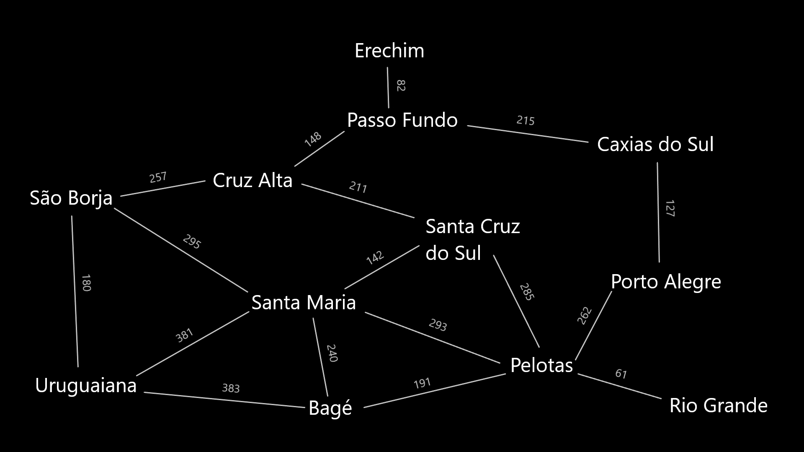
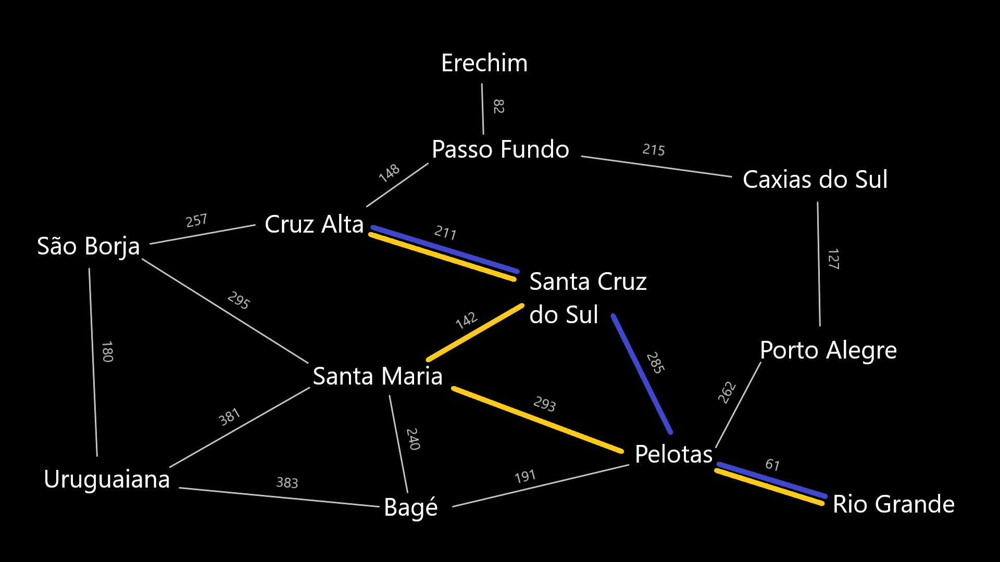

# simple_route_algorithms
This repository contains applications of breadth-first search (BFS), depth-first search (DFS), greedy, A* and dijkstra search algorithms in a simplified version of the cities of Rio Grande do Sul, a Brazilian state. 

## About the map

Many simplifications were made both in the number of cities, as in the routes between them.
Cities with more than 100,000 inhabitants were preferably chosen, as well as those not so close or in the same micro-region. 

In addition, it should be noted that all distances are given in kilometers and that the map does not represent the real scale. Therefore, some distances between cities are not in the right proportion in representation.

All distances that appear on the map were taken directly from google maps, with the shortest route between two cities being the method chosen to select the connection between them. 
## Euclidean distance

To implement the greedy search algorithms and A* it is necessary that the calculation of the Euclidean distance between one city and all the others is done. For this, the website https://www.adistanciaentre.com was used, which allows calculating the air distance between two cities.

## Comparison: A* - Greedy

Assuming that the blue route is found by the A* algorithm, while the yellow route is found by the greedy algorithm, the path decrease is noticeable.

- **A***: 61 + 265 + 211 = 530 km
- **Greedy**: 61 + 293 + 142 + 211 = 707 km

Therefore, the A* algorithm was much more efficient, reducing the total travel by 177 kilometers.
